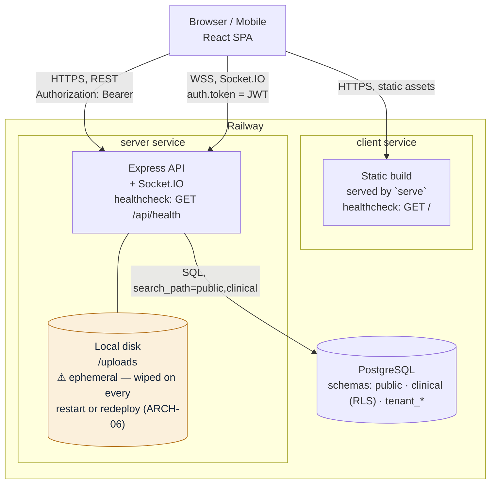

# Architecture — current deployment

Resolves ARCH-01 (`01-architecture-environments.md`): components, ports, and who talks
to whom, as actually deployed today.

This describes the **current** Railway deployment — two services, one shared Postgres
database, and local-disk file storage. It is intentionally smaller than the AWS target
architecture discussed separately; that one is where this is moving *to*, this one is
what is running *today*.

## What each piece is, and the one known problem

| Piece | What it is | Notes |
|---|---|---|
| **Browser / Mobile** | The React SPA, any role (patient, doctor, pharmacist, lab, org staff, admin) | — |
| **client service** | A second Railway service. Builds the Vite app, serves the static output with `serve` | `VITE_API_URL` is baked into the JS bundle at build time (ARCH-04) — one build only ever talks to one backend URL |
| **server service** | Express API + Socket.IO, one process | CORS allow-list currently includes `localhost` origins even in production (ARCH-04) |
| **Local disk (`/uploads`)** | Where prescription files, lab reports, and patient report uploads are written today | **Ephemeral** — deleted on every restart or redeploy. This is ARCH-06, the most urgent item in the audit. Target fix: move to S3 (see the AWS architecture doc) |
| **PostgreSQL** | One Railway-hosted instance | `public` (shared identity/catalog) + `clinical` (RLS-protected PHI) + one `tenant_*` schema per hospital/clinic/org |

## Request flow

1. Browser loads the SPA from the **client service** over HTTPS.
2. The SPA calls the **server service** over HTTPS for REST (`Authorization: Bearer <JWT>`), and opens a Socket.IO connection over WSS for live notifications (token passed as `auth.token` at handshake).
3. The server validates the JWT, runs the query against **PostgreSQL** with `search_path=public,clinical` so unqualified table names resolve correctly across both schemas.
4. File uploads are currently written to local disk on the server service — see the warning above.

## Not yet true, called out so it isn't missed

- **Only one environment exists** (production) — no staging. See ARCH-02/03 in the audit.
- **No shared state between server instances** — if the server ever runs as more than one copy, Socket.IO notifications and local-disk uploads both break in different ways (ARCH-05, ARCH-06). Today there is only one instance, so this isn't yet visible in practice.
